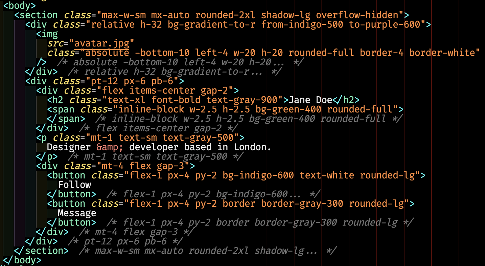

# Class Lens

Identify closing tags by their `className` at a glance. Class Lens shows the `className` or `class` value as an inline preview next to every closing tag, so you never lose track of which `</div>` belongs to which element.



## Installation

Search for **Class Lens** in the VS Code Extensions sidebar (`Ctrl+Shift+X` / `Cmd+Shift+X`) and click **Install**.

Alternatively, install from the command line:

```
code --install-extension Homuzu.class-lens
```

## What It Does

```jsx
<div className="flex items-center gap-4">
  <span className="text-lg font-bold">Hello World</span> // text-lg font-bold
</div> // flex items-center gap-4
```

When your JSX, HTML, or template markup gets deeply nested, matching a `</div>` to its opening tag means scrolling up and hunting for the right line. Class Lens solves this by showing the `className` or `class` value as a faded annotation right after each closing tag.

## Features

- **Works everywhere** — JSX, TSX, HTML, Vue, Svelte, Astro, PHP templates, ERB, and any file that uses `className=` or `class=` attributes
- **Two rendering modes** — text decorations (default, looks like a comment) or native VS Code inlay hints
- **Handles dynamic values** — template literals, ternary expressions, function calls like `cn()` and `clsx()` are all displayed
- **Zero config** — works out of the box, active on all languages by default
- **Lightweight** — no AST parsing, no language server, just fast regex matching

## Supported Patterns

| Code                                  | Annotation              |
| ------------------------------------- | ----------------------- |
| `className="flex gap-4"`              | `flex gap-4`            |
| `class="container mx-auto"`           | `container mx-auto`     |
| `className={styles.wrapper}`          | `wrapper`               |
| ``className={`text-${color}`}``       | `text-${color}`         |
| `className={active ? 'on' : 'off'}`   | `active ? 'on' : 'off'` |
| `className={cn('base', { bold: x })}` | `'base', { bold: x }`   |

Self-closing tags (``, `<br />`, `<input />`) are also annotated, but only when the `<` and `/>` are on different lines (so a one-line `` stays quiet by default). Set `classLens.hideSelfClosing` to `true` to skip them entirely.

## Settings

All settings are under `classLens.*` in VS Code settings.

| Setting             | Default        | Description                                                                                                                              |
| ------------------- | -------------- | ---------------------------------------------------------------------------------------------------------------------------------------- |
| `enabled`           | `true`         | Enable or disable annotations                                                                                                            |
| `renderMode`        | `"decoration"` | `"decoration"` for text decorations, `"inlayHint"` for native inlay hints                                                                |
| `maxLength`         | `40`           | Truncate long values (0 = no limit)                                                                                                      |
| `truncateType`      | `"word"`       | `"character"` for exact count, `"word"` for word boundary                                                                                |
| `truncatePosition`  | `"end"`        | `"end"` keeps the start, `"start"` keeps the end                                                                                         |
| `opacity`           | `"0.9"`        | Opacity of the annotation text                                                                                                           |
| `prefix`            | `"/*"`         | Text before the class value (a space between prefix and value is inserted automatically)                                                 |
| `suffix`            | `"*/"`         | Text after the class value (a space between value and suffix is inserted automatically; pair with `prefix` for block-comment style)      |
| `ellipsis`          | `"..."`        | Marker shown when a value is truncated (e.g. `"…"`, or `""` to disable)                                                                  |
| `showSameLine`      | `false`        | Show annotations on tags whose opening `<` and closing `>` are on the same line (off by default to avoid noise on one-line elements)     |
| `hideSelfClosing`   | `false`        | Skip annotations on self-closing tags (`<input />`, ``, etc.)                                                                     |
| `excludedLanguages` | `[]`           | Language IDs to exclude (e.g. `["markdown", "json"]`)                                                                                    |
| `transformPatterns` | `[...]`        | Regex transforms applied to values before display (strips `styles.` prefixes, unwraps `cn()`/`clsx()`/`cx()`/`classNames()` calls, etc.) |

## Render Modes

**Text Decorations** (default) — appends faded text after the closing tag, styled like a comment. Works in any theme.

**Inlay Hints** — uses VS Code's native inlay hint API. Respects your editor's inlay hint settings and theme colors. Toggle with `"classLens.renderMode": "inlayHint"`.

## FAQ

**Does it work with Tailwind CSS?**
Yes. Tailwind classes are just string values in `className` — they display exactly as written.

**Does it slow down my editor?**
No. The parser is a lightweight regex pass over the document text with a 200ms debounce on changes. There's no AST, no language server, and no file I/O.

**Can I use it with a language not listed?**
Yes. Class Lens runs on all languages by default. If it finds `className=` or `class=` in any file, it shows annotations. Use `excludedLanguages` to turn it off for specific languages.

**Why don't I see annotations on a single-line ``?**
Self-closing tags follow the same `showSameLine` rule as paired tags: hidden when the `<` and `/>` are on the same line, shown when the tag spans multiple lines. Flip `classLens.showSameLine` to `true` to see them on single-line tags too, or set `classLens.hideSelfClosing` to `true` to skip self-closing tags entirely.

## Known Issues

No known issues at this time. If you find a bug, please [open an issue](https://github.com/AdamANNAM/class-lens/issues).

## Contributing

Contributions are welcome! Please [open an issue](https://github.com/AdamANNAM/class-lens/issues) to report bugs or suggest features before submitting a pull request.

## License

[MIT](LICENSE)
